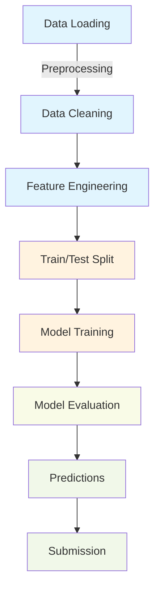
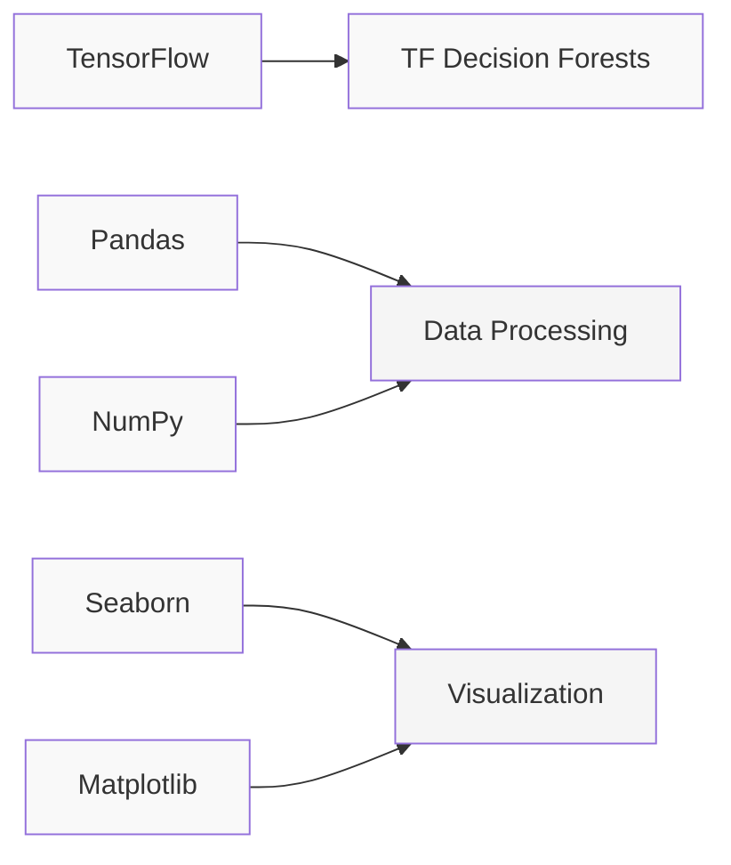
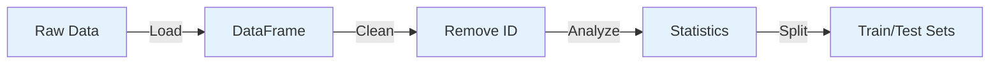
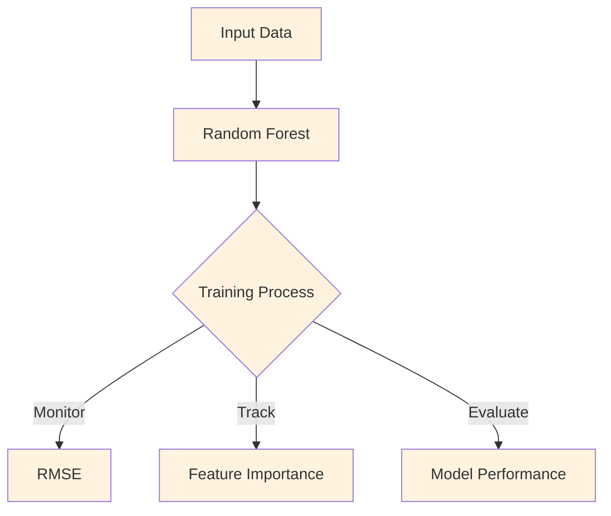
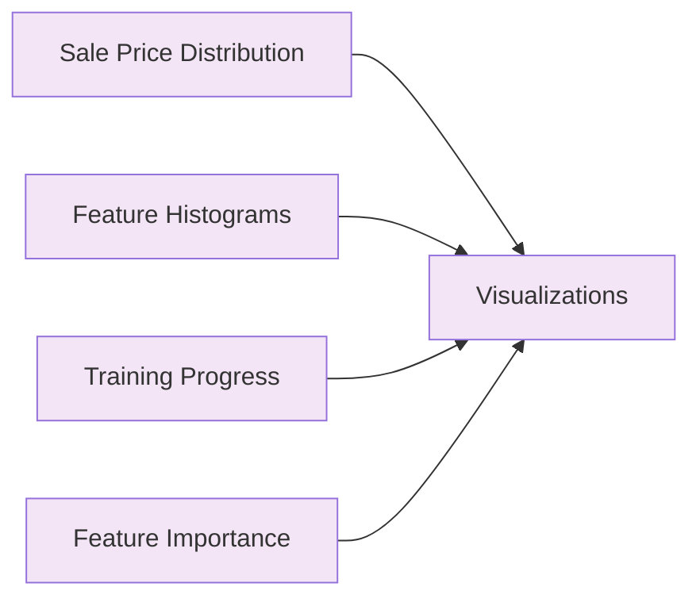
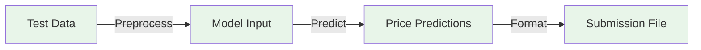
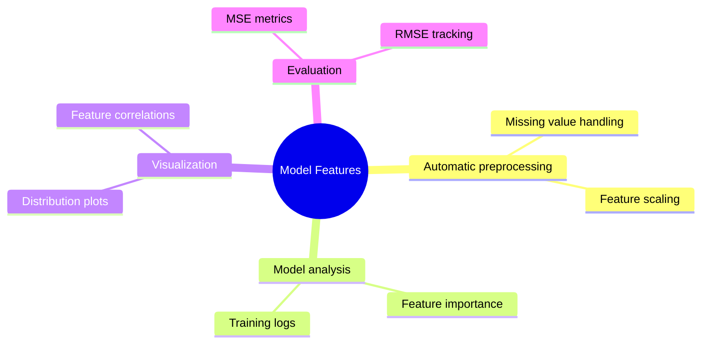

# House-Prices-Prediction-using-TFDF
# House Price Prediction using TensorFlow Decision Forests 🏠

A machine learning project using TensorFlow Decision Forests to predict house prices with Random Forest regression.

## 📊 Workflow Overview



## 🛠️ Requirements



## 📝 Implementation Steps

### 1. Environment Setup

```python
import tensorflow as tf
import tensorflow_decision_forests as tfdf
import pandas as pd
import seaborn as sns
import matplotlib.pyplot as plt
import numpy as np

print("TensorFlow v" + tf.__version__)
print("TensorFlow Decision Forests v" + tfdf.__version__)
```

### 2. Data Pipeline



#### Key Data Processing Steps:
```python
# Remove ID column
dataset_df = dataset_df.drop('Id', axis=1)

# Data splitting
def split_dataset(dataset, test_ratio=0.30):
    test_indices = np.random.rand(len(dataset)) < test_ratio
    return dataset[~test_indices], dataset[test_indices]

train_ds_pd, valid_ds_pd = split_dataset(dataset_df)
```

### 3. Model Architecture



#### Model Implementation:
```python
# Create and train model
rf = tfdf.keras.RandomForestModel(task=tfdf.keras.Task.REGRESSION)
rf.compile(metrics=["mse"])
rf.fit(x=train_ds)

# Model inspection
inspector = rf.make_inspector()
logs = inspector.training_logs()
```

### 4. Visualization Pipeline



### 5. Prediction & Submission



#### Submission Code:
```python
# Generate predictions
test_ds = tfdf.keras.pd_dataframe_to_tf_dataset(
    test_data,
    task=tfdf.keras.Task.REGRESSION)

preds = rf.predict(test_ds)

# Create submission file
sample_submission_df = pd.read_csv('../input/house-prices-advanced-regression-techniques/sample_submission.csv')
sample_submission_df['SalePrice'] = rf.predict(test_ds)
sample_submission_df.to_csv('/kaggle/working/submission.csv', index=False)
```

## 📈 Key Features



## 🔍 Model Performance Monitoring

The following metrics are tracked during training:
- Mean Squared Error (MSE)
- Root Mean Squared Error (RMSE)
- Feature importance rankings
- Training progress logs

## 📊 Sample Visualizations

When you run the code, you'll see visualizations for:
1. Sale price distribution
2. Numerical feature histograms
3. Training progress (RMSE vs number of trees)
4. Feature importance rankings

## 📝 Notes

- All visualizations are generated using matplotlib and seaborn
- The model automatically handles missing values
- Feature importance analysis helps identify key price predictors
- Training progress can be monitored in real-time

## 🚀 Usage

1. Clone the repository
2. Install requirements
3. Run the notebooks in order
4. Check the generated visualizations
5. View the submission file

---
*This README is enhanced with Mermaid diagrams. Make sure your GitHub markdown viewer supports Mermaid syntax.*
